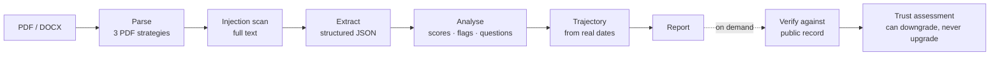

<div align="center">


# HireLens

**Resume credibility analysis that shows its working.**

Every score cites the sentence that produced it. Every claim is checked against
public record. Nothing is decided for you.

[](../../actions)
[](#testing)
[](#testing)
[](https://python.org)
[](https://nextjs.org)
[](https://fastapi.tiangolo.com)
[](https://supabase.com)

[Architecture](docs/ARCHITECTURE.md) ·
[Deployment](docs/DEPLOYMENT.md) ·
[API](docs/API.md) ·
[Security](docs/SECURITY.md) ·
[Contributing](CONTRIBUTING.md)

</div>

---

## Read this first

HireLens is **decision support, not a gatekeeper**. Every score, flag and
"verified"/"not found" result is a signal for a human recruiter to investigate
— never proof of misconduct, and never grounds for an automated reject.

Where the product cannot know something, it says so instead of guessing. That
constraint is the reason it exists.

---

## The problem

A recruiter reading forty resumes for one role has no way to tell which claims
are load-bearing. "Improved performance by 40%" reads the same whether it is
measured or invented. Screening tools answer this with a number and no
argument — which moves the guessing rather than removing it.

HireLens takes the opposite position: **show the evidence, and let the person
decide.**

<div align="center">

<br><em>Every concern quotes the sentence that raised it. They are prompts to ask a question, not conclusions.</em>
</div>

---

## What it does

<table>
<tr>
<td width="50%" valign="top">

### Credibility analysis
Six scored dimensions, a written summary, and risk flags that **quote the
resume text** that triggered them. One file or fifty at once.

</td>
<td width="50%" valign="top">

### Public-data verification
GitHub skills evidenced in real repositories, institutions checked against an
open registry, certificate links live-fetched, employer domains probed. Four
checks, run concurrently, each isolated.

</td>
</tr>
<tr>
<td valign="top">

### Career trajectory
Total experience, median tenure, advancement cadence and gaps — computed from
the **actual dates on the page** by a union-of-intervals pass. No model
involved, so no invented metric.

</td>
<td valign="top">

### Interview co-pilot
Questions generated from that candidate's specific flags, a scorecard, and
private notes that stay private. Tested for cross-tenant access on both
storage paths.

</td>
</tr>
<tr>
<td valign="top">

### JD match
Rank a shortlist against one job description. Matching skills, missing skills,
a verdict and a rationale per candidate.

</td>
<td valign="top">

### ATS import + team review
Import a Greenhouse/Lever/Workday CSV; resumes download and analyse through the
same pipeline. Share a candidate with a team, comment, and vote.

</td>
</tr>
</table>

### The metric that is honest about itself

An earlier build shipped a "Talent Velocity" score computed as
`60 + roles×5 + skills×2` — a number that looked analytical, saturated near 98
for anyone with a long resume, and measured nothing. It was replaced with
metrics derived from real employment dates, and when the dates are too sparse
to support a conclusion the panel says `insufficient_data` and explains why.

---

## How it works



The LLM falls through **Gemini → Groq → Anthropic**, and a rate limit hands off
immediately rather than spending a backoff first. If every provider is
unconfigured, uploads are refused up front with a clear message instead of
producing a half-written report.

Full detail in [**docs/ARCHITECTURE.md**](docs/ARCHITECTURE.md).

---

## Screenshots

<table>
<tr>
<td width="50%"><br><sub><b>Report</b> — score, summary, and the evidence behind it</sub></td>
<td width="50%"><br><sub><b>Verify</b> — public-record checks with a signed trust score</sub></td>
</tr>
<tr>
<td><br><sub><b>Co-Pilot</b> — scorecard and private interview notes</sub></td>
<td><br><sub><b>JD Match</b> — rank a shortlist against one role</sub></td>
</tr>
<tr>
<td><br><sub><b>Bulk</b> — up to 50 resumes, live ranking</sub></td>
<td><br><sub><b>Questions</b> — generated from this candidate's own flags</sub></td>
</tr>
<tr>
<td><br><sub><b>Teams</b> — share a candidate, comment, vote</sub></td>
<td><br><sub><b>Analyze</b> — one resume, with the limits stated up front</sub></td>
</tr>
</table>

<div align="center">

<br><em>The same dashboard at 390px — a recruiter reviewing between meetings gets the whole thing, not a cut-down version.</em>
</div>

---

## Quick start

```bash
git clone https://github.com/Shweta-Mishra-ai/hirelens.git && cd hirelens

# API
cd backend
python -m venv .venv && source .venv/bin/activate    # Windows: .venv\Scripts\activate
pip install -r requirements.txt -r requirements-dev.txt
cp .env.example .env                                  # add GEMINI_API_KEY (free)
uvicorn app.main:app --reload --port 8000

# Frontend, in a second terminal
cd frontend
npm install
cp .env.local.example .env.local
npm run dev
```

App on **localhost:3000**, interactive API docs on **localhost:8000/docs**.

Leave the Supabase variables unset and everything runs on a local SQLite file —
no cloud account needed to develop. For production, follow
[**docs/DEPLOYMENT.md**](docs/DEPLOYMENT.md): three SQL files, one Render
service, one Vercel project.

---

## Built to degrade, not to break

The interesting engineering here is not the happy path.

| When this happens | The app does this |
|---|---|
| Gemini rate-limits | Hands off to Groq immediately — no backoff burned on a 429 |
| Supabase is unreachable at signup | Returns 503. It will **not** create a local account whose id Postgres has never heard of |
| Supabase rejects a password | 401 stands — a stale local password cannot override the identity provider |
| The database blips mid-session | The list raises a real error; an empty page must never read as "your candidates are gone" |
| One verification check throws | The other three still return |
| A stored report has the wrong shape | Coerced at the read boundary — one odd report cannot take down the whole list |
| A panel throws while rendering | Its error boundary catches it; navigation and every other panel stay up |
| A 380 KB DOCX unpacks to 194 MB | Refused from the archive directory, before a byte is decompressed |

Each of those is a bug that was found by running the thing, reproduced, fixed,
and then pinned by a test that fails without the fix.

---

## Testing

```bash
cd backend && python -m pytest tests/ -v           # 1,149 tests
cd frontend && npm test                            # 105 tests
cd frontend && npm run build                       # types + production build
```

| | |
|---|---|
| Backend | **1,149** tests · **86%** coverage |
| Frontend | **105** tests · strict TypeScript · zero lint warnings |
| CI | pytest · vitest · `pip-audit` · `npm audit` · production build |

Two habits the suite is built on:

**Both storage paths are tested.** Every endpoint has a Supabase
implementation and a SQLite fallback. `tests/fake_supabase.py` carries the real
column list for every table and raises the same `PGRST204` the database would —
which is what caught `create_team` inserting an `id` into a table that has
none, silently leaving every team's owner without a membership row.

**A missing name is a test failure.** A batch edit once added `as_dict(...)`
calls without the import; `NameError` fires only when the line runs, that line
sat inside an `except Exception`, and the endpoint still answered 200 — so
saving interview notes had quietly stopped working with every test green. A
pyflakes test now fails on any name used before it is defined.

---

## Performance

Measured locally against 500 stored reports, cold cache:

| Endpoint | p50 |
|---|---|
| `GET /reports` | 6.4 ms |
| `GET /reports?search=` | 6.1 ms |
| `GET /reports?sort=score_desc` | 6.2 ms |
| `GET /reports/analytics` | 5.8 ms |
| `GET /reports/export.csv` | 11.8 ms |
| `GET /health` | 3.0 ms |

Frontend: 87.3 kB shared JS, 176–196 kB First Load per route. Eight unused
dependencies were removed rather than carried.

---

## Stack

**Backend** — FastAPI · Python 3.12 · Pydantic v2 · Supabase (Postgres + Auth)
· SQLite fallback · optional Redis · pdfminer.six · python-docx · bcrypt

**Frontend** — Next.js 14 App Router · TypeScript (strict) · Tailwind ·
Zustand · Vitest + Testing Library

**AI** — Gemini 2.5 Flash, with Groq and Anthropic as fallbacks

---

## Documentation

| | |
|---|---|
| [**Architecture**](docs/ARCHITECTURE.md) | Diagrams, request lifecycle, where state lives, the degradation table |
| [**Deployment**](docs/DEPLOYMENT.md) | Supabase schema, Render, Vercel, keeping the free tier awake |
| [**API**](docs/API.md) | Every endpoint, the error envelope, the limits |
| [**Security**](docs/SECURITY.md) | Tenancy model, resume-borne attacks, what is deliberately not disclosed |
| [**Contributing**](CONTRIBUTING.md) | Setup, conventions, what a good PR looks like |

---

## Licence

Not yet chosen — there is no `LICENSE` file in this repository, which means
default copyright applies and nobody else may use, copy or modify the code.
If you want that to change, add one (MIT and Apache-2.0 are the usual choices
for a project like this) and link it here.
