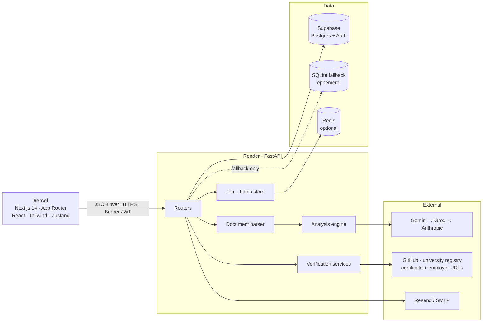
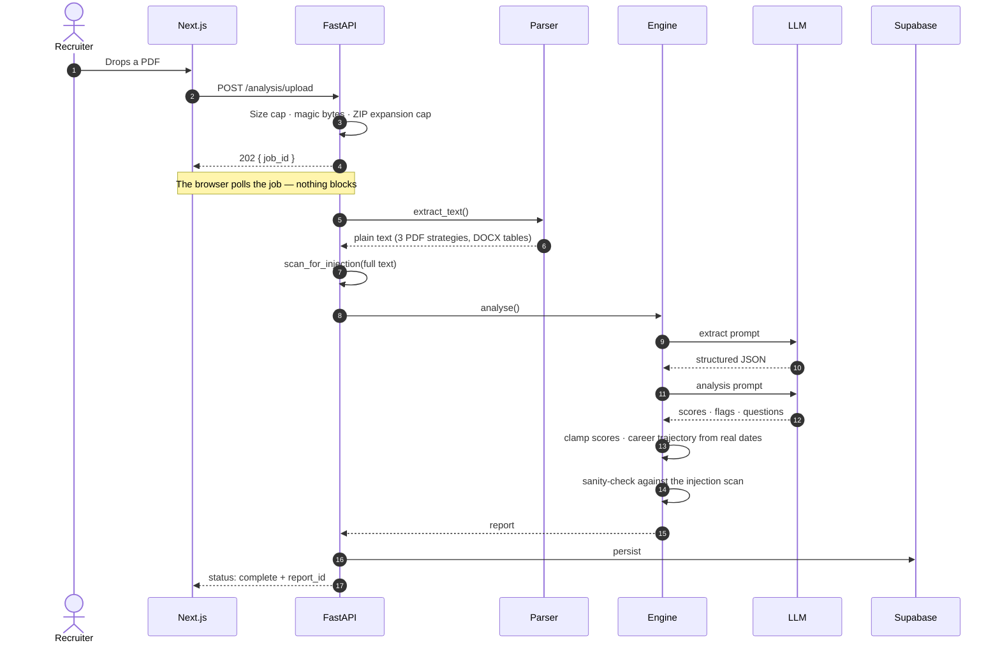
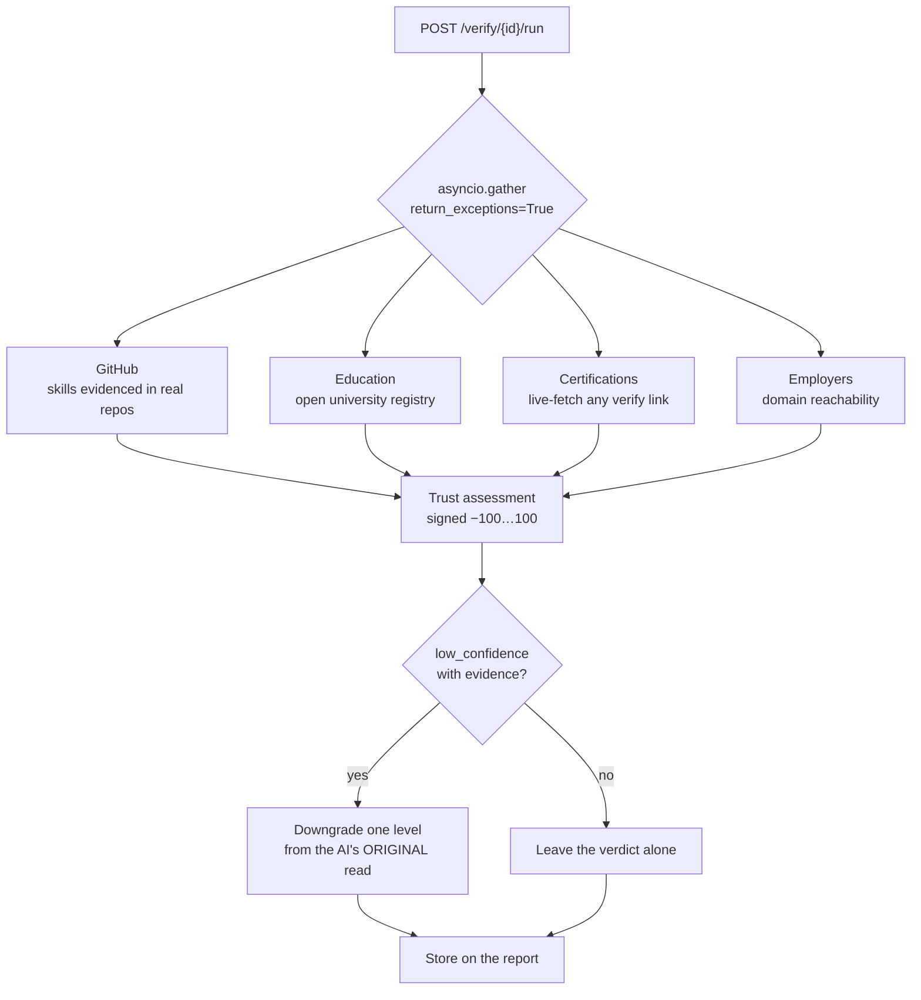
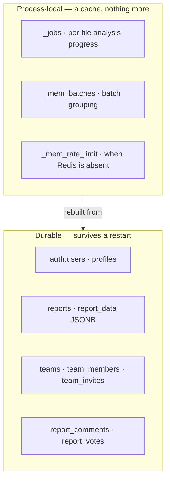
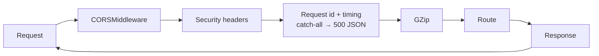

# Architecture

How a PDF becomes a credibility report, where every piece of state lives, and
why the system is built to degrade rather than fall over.

---

## The shape of it



**One rule runs through all of it:** a failure in any external box degrades one
feature, never the request that touches it. The LLM falls through three
providers, verification isolates its four checks from each other, Redis is
optional, and the reports list raises a real error rather than returning an
empty page that reads as "you have no candidates".

---

## Analysing a resume



**Why a job id and not a response.** An analysis is two LLM round trips and can
take 20–60 seconds. Holding the HTTP connection open for that ties up a worker
and dies to any proxy timeout in between. The upload returns immediately; the
work happens in a background task and the browser polls.

---

## Verification

Four independent checks, run concurrently, each isolated from the others:



Three deliberate asymmetries:

| Rule | Why |
|---|---|
| Strong contradicting evidence can **downgrade** a verdict | The AI scores the resume before anything is checked against the world. A GitHub account that does not exist outranks a good writing sample. |
| Nothing can **upgrade** a verdict | Verification passing does not resolve concerns verification never looked at — timeline gaps, inconsistent claims, unbaselined metrics. |
| Re-running lands on the same verdict | The drop is measured from the AI's original read, so clicking Verify twice cannot walk a candidate down two levels on the same evidence. |

Every URL the candidate can influence — certificate links, guessed employer
domains, ATS resume URLs — goes through an SSRF guard that re-validates on
**every redirect hop**, not just the first.

---

## Where state lives



The distinction is load-bearing. Everything that must outlive the process is
written to Postgres (or the local fallback) first, and the in-process copy
exists only to save a round trip — so replacing the container costs nothing
but a cache. An analysis whose progress is lost that way is recovered from
the report it produced, by job id.

**Redis is optional on purpose.** Without it, rate limits and batch grouping
are per-process, which is correct for the single-worker free tier. Setting
`REDIS_URL` makes both shared, which is what horizontal scaling needs.

---

## Degrading instead of breaking

| What goes wrong | What happens |
|---|---|
| Gemini rate-limits | Falls straight through to Groq, then Anthropic — no backoff spent on a 429 |
| All three LLMs fail | Upload is refused up front with `analysis_unavailable`, not a half-written report |
| Supabase is unreachable at signup | **503.** No local shadow account, because its user id could never own a Supabase row |
| Supabase rejects a login | 401 stands. A stale local password cannot override the identity provider |
| Supabase blips mid-session | Reports list raises a real error; the co-pilot says "nothing has been lost" rather than "not found" |
| One verification check throws | The other three still return; the failing one reports `error` |
| A stored report has the wrong shape | Coerced at the read boundary — one odd report cannot take down the whole list |
| A panel throws while rendering | Its error boundary catches it; navigation and every other panel stay up |
| A 380 KB DOCX unpacks to 194 MB | Refused from the archive directory, before a byte is decompressed |

---

## Request lifecycle



CORS is **outermost** by design, so that error responses carry the same
headers as successful ones. A 500 that the browser refuses to hand to the app
is indistinguishable from the API being unreachable — everything the server
says, including "something went wrong", has to be readable by the app that
asked.

Every error response carries the same envelope:

```json
{ "error": "machine_code", "message": "A sentence a person can act on.", "request_id": "a1b2c3d4" }
```

---

## Layout

```
backend/
  app/
    api/v1/endpoints/   analysis · bulk · match · ats · reports · verify
                        copilot · collaboration · teams · auth · health
    core/               config · security · dependencies · exceptions
                        local_db · rate_limit · shapes
    services/
      ai/               engine (3-provider fallback) · career_trajectory
      verify/           github · education · certification · company
                        ssrf_guard · trust_assessment
      parser/           document_parser · csv_import · resume_heuristic
      fraud/            duplicate_detection · injection_detection
      queue/            job_store · batch_store
      teams/            access
      email/            sender
      directory.py      user id → a person's name, on either store
  sql/                  001 core · 002 collaboration · 003 notifications
  tests/                unit/ · integration/ · fake_supabase.py

frontend/
  src/
    app/                dashboard · analyze · bulk · match · report/[id] · teams
                        error.tsx · not-found.tsx · global-error.tsx
    components/         ui/ (design system) · report/ (panels) · AppShell
    hooks/              useBulkAnalysis · useJdMatch · useGoogleAuth
    lib/                api · format · cn · list · design-tokens
    store/              auth (Zustand + persist)
```
