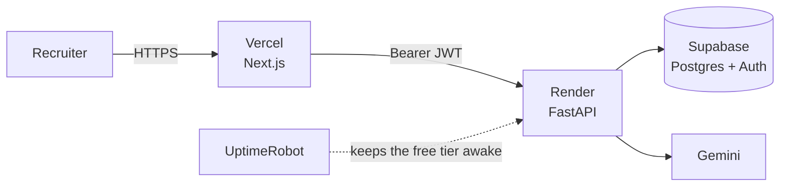
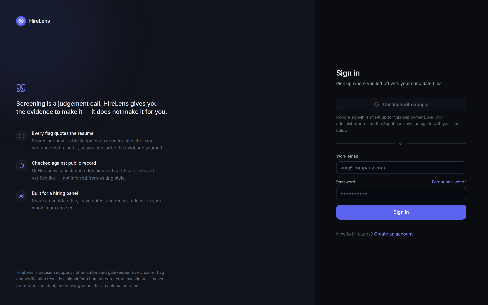

# Deployment

Three services, one afternoon. Supabase holds the data and the accounts,
Render runs the API, Vercel serves the frontend.



---

## 1 · Supabase

Create a project, then run these three files in the **SQL Editor**, in order.
Every statement is idempotent, so re-running the set is a no-op rather than an
error.

| Order | File | Creates |
|:--:|---|---|
| 1 | `backend/sql/001_core_schema.sql` | `reports` with the indexes the dashboard's filters and sorts need, `profiles` with its trigger and backfill |
| 2 | `backend/sql/002_team_collaboration.sql` | `teams`, `team_members`, `team_invites`, `report_comments`, `report_votes`, `reports.team_id` |
| 3 | `backend/sql/003_candidate_notifications.sql` | the `candidate_notified_*` columns |
| 4 | `backend/sql/004_normalize_invite_emails.sql` | one spelling for an invited address, so an invite always matches the person who was invited |
| 5 | `backend/sql/005_saved_job_descriptions.sql` | `saved_jds`, so a role's description is written once and reused |

**002 must come after 001** — it adds a column to `reports` and foreign-keys
four tables to it.

Verify from the SQL Editor:

```sql
select table_name from information_schema.tables
where table_schema = 'public' order by table_name;
-- profiles, report_comments, report_votes, reports, team_invites, team_members, teams
```

### Why `profiles` exists

Supabase keeps users in `auth.users`, which PostgREST does not expose. Comment
threads, team rosters and the signature on candidate emails all need to turn a
user id into a person, so `001` mirrors the readable fields into
`public.profiles`, keeps them in step with a trigger on `auth.users`, and
backfills anyone who signed up earlier. Without it every teammate shows as a
neutral badge and candidate emails go out signed with the recruiter's raw
email address.

### Turn on leaked-password protection

Free, one toggle, and it blocks the passwords that actually get used in
credential-stuffing runs:

1. Supabase dashboard → your project
2. **Authentication** → **Policies** (older UI: **Providers → Email**)
3. Find **Leaked password protection** and switch it **on**
4. Optionally raise **Minimum password length** to 10 and require mixed
   character classes

Supabase then checks new passwords against HaveIBeenPwned using a k-anonymity
prefix — the password itself never leaves Supabase. Confirm it took with
`get_advisors` or the **Advisors → Security** page; the warning disappears.

### Allow the password reset page to be redirected to

**Required.** Without it, password reset is a dead end.

When someone asks to reset their password, the API tells Supabase to send them
to `https://<your-frontend>/reset-password`. Supabase only honours that if the
URL is on its allowlist — otherwise it quietly sends the recovery token to the
project's Site URL instead, where nothing reads it, and the person ends up
staring at the dashboard with no way to continue.

1. Supabase dashboard → **Authentication** → **URL Configuration**
2. Set **Site URL** to your frontend origin, e.g. `https://hirelens-theta.vercel.app`
3. Under **Redirect URLs**, add:
   - `https://<your-frontend>/reset-password`
   - `https://<your-frontend>/**` if you also deploy previews

The same page governs where a Google sign-in and an email confirmation land,
so it is worth getting right once.

#### About the emails themselves

Supabase's built-in SMTP is rate-limited to a handful of messages per hour and
is documented as being for development only. For real users, set a custom SMTP
provider under **Authentication → Emails → SMTP Settings**, or the reset emails
your customers ask for will silently stop arriving on a busy day.

Deployments running **without** Supabase send this email themselves, through
`RESEND_API_KEY` or the `SMTP_*` variables. With neither configured the token
is still created but nothing carries it, so the request is logged at ERROR
level rather than passing quietly — check the Render logs for
"no email provider accepted the message" if resets are not arriving.

### Google sign-in

**Authentication → Providers → Google.** You need a Google Cloud OAuth client
(Web application), with Supabase's callback URL — shown on that same page —
added to *Authorised redirect URIs*. Paste the client id and secret into
Supabase.

The API reports its half of the readiness at `GET /api/v1/health` as
`google_auth_ready`, and the frontend hides the button when it is false rather
than showing one that fails at the verification step.

<div align="center">

</div>

---

## 2 · Render — the API

`render.yaml` is in the repo. Point Render at the fork and set these:

| Variable | Required | Notes |
|---|:--:|---|
| `SECRET_KEY` | ✅ | 32+ random characters. Signs the session JWTs |
| `GEMINI_API_KEY` | ✅ | Free at [aistudio.google.com](https://aistudio.google.com) |
| `SUPABASE_URL` | ✅ | `https://<ref>.supabase.co` |
| `SUPABASE_SERVICE_KEY` | ✅ | **service_role**, never the anon key. Server-side only |
| `SUPABASE_ANON_KEY` | ✅ | Public key, used for the OAuth round trip |
| `ALLOWED_ORIGINS` | ✅ | Your Vercel URL, comma-separated for several |
| `APP_ENV` | ✅ | `production` |
| `TRUSTED_PROXY_HOPS` | ➖ | Proxies in front of the app. `1` (the default) is right for Render; `2` behind Cloudflare; `0` with no proxy |
| `GITHUB_TOKEN` | ➖ | Lifts GitHub verification from 60 to 5,000 requests/hour |
| `GROQ_API_KEY` | ➖ | Second LLM provider |
| `ANTHROPIC_API_KEY` | ➖ | Third LLM provider |
| `RESEND_API_KEY` | ➖ | Candidate and invite emails |
| `REDIS_URL` | ➖ | Shared rate limits and batches across instances |

> **Get `TRUSTED_PROXY_HOPS` right.** Rate limits are keyed on the caller's
> IP, which behind a proxy comes from `X-Forwarded-For` — a header the caller
> also sets. Each proxy appends the address it saw, so only that many entries
> from the right are evidence. Setting it too high keys everyone to the same
> proxy address; too low, and a caller can change the header per request.
> Render is one hop.

> **The service key must never reach a browser.** It bypasses row-level
> security entirely. Put it on Render only — never in Vercel, and never in any
> `NEXT_PUBLIC_*` variable, which is inlined into the JavaScript bundle every
> visitor downloads.

### The GitHub token

A **fine-grained** token with **Public repositories (read-only)** and **no
permissions granted** is enough — verification only reads public data. A
classic token with zero scopes behaves identically. Either takes the rate
limit from 60 requests/hour to 5,000.

### Free-tier durability

The container filesystem is ephemeral and the free plan replaces the container
on every deploy *and* every wake from sleep. With Supabase configured this does
not matter — Postgres is the store. Without it, the SQLite fallback is erased
along with every account and report in it.

For a persistent disk instead, change `plan: free` to `plan: starter` and
uncomment the `disk:` block. **Adding that block while `plan: free` is set
makes the deploy fail** — disks are not available on the free plan.

---

## 3 · Vercel — the frontend

Root directory `frontend`, framework Next.js, one variable:

```env
NEXT_PUBLIC_API_URL=https://your-api.onrender.com
```

Then add that Vercel URL to `ALLOWED_ORIGINS` on Render and redeploy the API.
Anything named `NEXT_PUBLIC_*` ships to the browser, so nothing secret goes
here.

---

## 4 · Keeping the free tier awake

Render's free plan sleeps after 15 minutes idle, and waking takes 30–60
seconds — long enough that a recruiter thinks the app is broken. Point
[UptimeRobot](https://uptimerobot.com) (or any monitor) at:

```
https://your-api.onrender.com/api/v1/health
```

every 5 minutes. That endpoint is deliberately cheap and deliberately says
*whether* each service is well without saying *why* — a Postgres error
routinely names the host or the schema, and this is the one route reachable
without an account. The detail is in the logs and in
`/api/v1/health/diagnostics`, which requires a token.

---

## When something says it failed

A red tick is not a diagnosis. Each of these looks like a broken build or a
broken server and is caused by something else entirely.

### CI jobs fail in about two seconds with no logs

Open any failed job. If it shows **no runner** (`runner_id: 0`, an empty
runner name) and the log download 404s, no step ever executed — this says
nothing about the code.

That is GitHub Actions declining to run, almost always the monthly minute
allowance. Public repositories get Actions free; private ones spend from a
quota, so making a repository private can silently stop CI. Check
**Settings → Billing and licensing → Actions** for minutes used and whether
the spending limit is £0.

While that is unresolved, `./scripts/verify.sh` runs the same four steps this
workflow runs, with the same Python version and environment, and tells you
what CI would have.

### The API is unreachable, or the first request takes a minute

Render's free instances sleep after roughly 15 minutes idle, and the request
that wakes one waits 30–60 seconds for the container to start. Set
`BACKEND_URL` to the service's own public URL so the keep-alive self-ping
runs — without it the pinger logs a warning at startup and does nothing.

### The API returns 502, or the deploy never goes live

Read the Render logs from the top. The app refuses to start, on purpose, in
two cases, and says which in the last line before it exits:

- `SECRET_KEY` missing or under 32 characters in production. Tokens signed
  with a key published in a public repository can be forged by anyone.
- `ALLOWED_ORIGINS` set to `*` in production. That lets any website make
  authenticated requests to the API.

Both are configuration, not code. Set the variable and redeploy.

### The Docker build cannot find the Dockerfile or requirements.txt

`render.yaml` builds with `dockerContext: ./backend`, because the Dockerfile
copies `requirements.txt` from the build context. A root context cannot see
it. If the Render service was created by hand rather than from this
blueprint, set **Root Directory** to `backend` in the service settings.

### Vercel builds nothing, or 404s on every route

The Next app is in `frontend/`, not at the repository root. The Vercel
project needs **Root Directory** set to `frontend`. The `vercel.json` at the
root is empty by design and does not override that setting.

### Password reset emails stop arriving

Supabase's built-in SMTP is rate-limited to a handful of messages an hour and
is documented as development-only. Set custom SMTP under
**Authentication → Emails**.

---

## Verifying the deployment

```bash
curl -s https://your-api.onrender.com/api/v1/health | jq
```

```json
{
  "status": "ok",
  "services": { "database": "ok", "gemini": "configured" },
  "llm_ready": true,
  "google_auth_ready": true
}
```

| Symptom | Cause |
|---|---|
| `"database": "error"` | Service key wrong, or `001` was never run |
| `"llm_ready": false` | No LLM key set — uploads are refused up front |
| `"google_auth_ready": false` | `SUPABASE_URL` or `SUPABASE_SERVICE_KEY` missing |
| CORS error in the browser | Vercel URL not in `ALLOWED_ORIGINS`, or a trailing slash |
| Signup returns 503 | Supabase unreachable. Deliberate — it will not create a local account whose id Postgres has never heard of |

Then walk it once by hand: sign up → upload a CV → open the report → create a
team → invite someone → leave a comment.

---

## Local development

```bash
git clone https://github.com/Shweta-Mishra-ai/hirelens.git && cd hirelens

cd backend
python -m venv .venv && source .venv/bin/activate   # Windows: .venv\Scripts\activate
pip install -r requirements.txt -r requirements-dev.txt
cp .env.example .env                                 # add GEMINI_API_KEY
uvicorn app.main:app --reload --port 8000

cd ../frontend                                       # new terminal
npm install
cp .env.local.example .env.local
npm run dev
```

Frontend on `:3000`, API docs on `:8000/docs`. Leave the Supabase variables
unset and everything runs on a local SQLite file — no cloud account needed to
develop.
