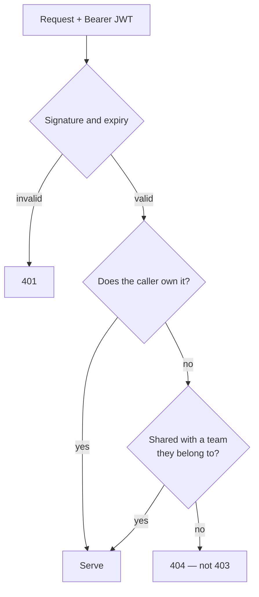

# Security

What HireLens holds, what is enforced, and what is deliberately left to a
human.

---

## What is at stake

| Data | Sensitivity |
|---|---|
| Candidate resumes | Name, email, phone, address, employment history |
| Interview notes | Compensation expectations, candid assessments |
| Credibility scores and flags | Judgements that affect someone's livelihood |
| Recruiter accounts | Credentials, team membership |

The interview notes are the sharpest edge in the product. A leak there is not
an inconvenience; it is a recruiter's private assessment of a named person,
reaching that person or a competitor.

---

## Tenancy

Separation is enforced **in application code**, not by row-level security. The
backend connects with the service-role key, which bypasses RLS entirely; every
query filters on `user_id`, and `app/services/teams/access.py` gates anything
shared. The RLS policies in `backend/sql/` are the second line, so the anon and
authenticated keys stay safe if anything is ever read straight from a browser.

A report you may not see returns **404, not 403** — 403 confirms the id exists,
which is a candidate's existence confirmed to someone with no right to it.

### Fixed here

| | |
|---|---|
| **Auth bypass** | `/auth/oauth-verify` minted a valid 7-day token for *any* string, including an empty one. Its only input is an unverified access token, which made it an unauthenticated token issuer. There is now no fallback: unverifiable means refused |
| **Cross-tenant co-pilot leak** | The read path took a report id with no access check, and the write path wrote before checking. Any account could read and overwrite another's interview notes |
| **Reports visible to everyone** | The in-memory listing checked a key report blobs never had and treated "no owner" as "everyone". It now fails closed |
| **Removal that did nothing** | Removing a member rebound a module-level name instead of mutating the shared list, so the authorization check never saw it. Deleting a team left membership behind entirely — ex-members kept access to anything shared with it |
| **Shadow identities** | A Supabase blip during signup created a local account whose id `auth.users` had never heard of. A rejected login fell through to the local store, where a stale password could beat the real one |

---

## Resume-borne attacks

A resume is a file from a stranger, parsed by an LLM, and often containing URLs
the sender chose. Three separate defences:

### Prompt injection

`scan_for_injection` runs over the **full** text, not the 9,000-character slice
the model sees — an instruction placed past the truncation point still counts.
It never blocks the upload; it informs a sanity check on the output. A resume
that scores suspiciously clean *and* carries injection markers has the clean
result overridden rather than trusted.

### SSRF

Every URL the candidate can influence — certificate links, employer domains
guessed from company names, ATS resume URLs — goes through
`app/services/verify/ssrf_guard.py`, which resolves the host and refuses
private, loopback, link-local, reserved and multicast addresses plus the known
metadata hostnames.

**The guard re-runs on every redirect hop.** Checking only the first URL is no
check at all: a host returns a public-looking URL, then a 302 to
`169.254.169.254`. Redirects are followed manually, capped at 3 hops, with the
guard in front of each.

### Resource exhaustion

| Vector | Bound |
|---|---|
| Large upload | 10 MB per file, 150 MB per batch, enforced as bytes arrive |
| **DOCX zip bomb** | 380 KB unpacking to 194 MB passed every size check and cost 531 MB of RSS. The archive directory is now read first; over 25 MB is refused before a byte is decompressed |
| Runaway text | Extraction stops past twice the 60,000 characters ever sent to the model |
| ATS download | Streamed, aborted past 10 MB rather than buffered and measured after |
| CSV | Oversized fields and NUL bytes are skipped rows, not a 500 |

---

## Credentials

| | |
|---|---|
| Passwords | bcrypt, cost 12. Over 72 bytes are pre-hashed, since bcrypt silently truncates there |
| Legacy hashes | An older unsalted SHA-256 still verifies via `hmac.compare_digest`, and is upgraded in place on the next successful login |
| Sessions | HS256 JWT, 7 days, signed with `SECRET_KEY` |
| Service key | Render only. Never in Vercel, never in a `NEXT_PUBLIC_*` variable |
| Seeded account | A `demo@hirelens.ai` account with a fixed password used to be created on every startup — including in production, which is exactly where the Supabase fallback runs. Removed |

---

## What is not disclosed

| Surface | Rule |
|---|---|
| `/health` | Whether a service is well, never why. Detail is in the logs and in the authenticated diagnostics route. The switch is a function, not a route argument — an argument would be a query parameter, and `?detail=true` would hand it straight back |
| 500 responses | A generic sentence and a request id. The traceback goes to the log |
| Login failures | Never reveal whether the address exists |
| Forgot password | Always 200, same body |
| LLM errors | The Gemini key is in the query string, so httpx puts it in connection errors. It is masked before the error is logged or surfaced |
| DOCX parse errors | The library's own message is logged; the user gets advice |

---

## Dependencies

CI runs `pip-audit` on the backend and `npm audit` on the frontend on every
push. Eight frontend packages nothing imported were removed rather than kept
patched.

---

## Reporting a vulnerability

Open a private security advisory on the repository, or email the maintainer.
Please do not file a public issue first.

---

## The limits, stated plainly

HireLens is decision support, not a gatekeeper.

- Scores and flags are **signals for a human to investigate**, never proof.
- The verification checks are **best-effort reads of public data**. "Not found"
  means not found in public data — most professional work lives in private
  repositories, and registry coverage is incomplete.
- The employer domain check is an **explicit heuristic**. It false-negatives on
  unregistered businesses, non-`.com` domains and rebrands, and is reported as
  a weak signal, never a red flag.
- Verification can **downgrade** the AI's read on strong contradicting
  evidence. It can never **upgrade** it, because passing a check does not
  resolve a concern the check never looked at.
- Duplicate detection finds **similar text**, not plagiarism.
- No output should be used for an automated reject.
