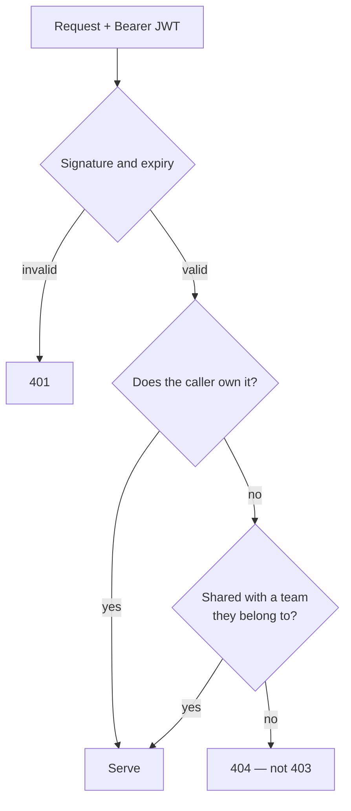

# Security

What HireLens holds, what is enforced, and what is deliberately left to a
human.

---

## What is at stake

| Data | Sensitivity |
|---|---|
| Candidate resumes | Name, email, phone, address, employment history |
| Interview notes | Compensation expectations, candid assessments |
| Credibility scores and flags | Judgements that affect someone's livelihood |
| Recruiter accounts | Credentials, team membership |

Interview notes are the most sensitive record in the product: a recruiter's
private assessment of a named person, alongside compensation expectations.
They are treated accordingly — every route that touches them checks access
first, and a report you may not see is a 404 rather than a 403.

---

## Tenancy

Separation is enforced **in application code**, not by row-level security. The
backend connects with the service-role key, which bypasses RLS entirely; every
query filters on `user_id`, and `app/services/teams/access.py` gates anything
shared. The RLS policies in `backend/sql/` are the second line, so the anon and
authenticated keys stay safe if anything is ever read straight from a browser.

A report you may not see returns **404, not 403** — 403 confirms the id exists,
which is a candidate's existence confirmed to someone with no right to it.

## Resume-borne attacks

A resume is a file from a stranger, parsed by an LLM, and often containing URLs
the sender chose. Three separate defences:

### Prompt injection

`scan_for_injection` runs over the **full** text, not the 9,000-character slice
the model sees — an instruction placed past the truncation point still counts.
It never blocks the upload; it informs a sanity check on the output. A resume
that scores suspiciously clean *and* carries injection markers has the clean
result overridden rather than trusted.

### SSRF

Every URL the candidate can influence — certificate links, employer domains
guessed from company names, ATS resume URLs — goes through
`app/services/verify/ssrf_guard.py`, which resolves the host and refuses
private, loopback, link-local, reserved and multicast addresses plus the known
metadata hostnames.

**The guard re-runs on every redirect hop.** Checking only the first URL would
be no check at all — a host can answer with a public-looking URL and then
redirect to an internal address. Redirects are followed manually, capped at 3
hops, with the guard in front of each one.

### Resource exhaustion

| Vector | Bound |
|---|---|
| Large upload | 10 MB per file, 150 MB per batch, enforced as bytes arrive |
| Compressed archives | A DOCX is a ZIP, so the upload cap alone does not bound it. The archive directory is read first and anything unpacking past 25 MB is refused before a byte is decompressed |
| Runaway text | Extraction stops past twice the 60,000 characters ever sent to the model |
| ATS download | Streamed and aborted past 10 MB, so the limit bounds memory rather than being checked after the fact |
| CSV | Oversized fields and NUL bytes are skipped rows, never a failed import |

---

## Credentials

| | |
|---|---|
| Passwords | bcrypt, cost 12. Inputs over 72 bytes are pre-hashed, so a long passphrase keeps its full entropy |
| Legacy hashes | An older unsalted SHA-256 still verifies via `hmac.compare_digest`, and is upgraded in place on the next successful login |
| Sessions | HS256 JWT, 7 days, signed with `SECRET_KEY` |
| Brute force | 10 sign-in attempts per 15 minutes per address, 8 signups per hour. Keyed on the address the proxy observed, counted `TRUSTED_PROXY_HOPS` entries from the right of `X-Forwarded-For`, so the header cannot be used to mint a fresh bucket |
| Service key | Render only. Never in Vercel, never in a `NEXT_PUBLIC_*` variable |
| Default accounts | None. No account is seeded at startup on any deployment, so there is no shared or well-known credential to find |

---

## What is not disclosed

| Surface | Rule |
|---|---|
| `/health` | Whether a service is well, never why. The detail is in the logs and in the authenticated diagnostics route, and is not reachable by any query parameter |
| 500 responses | A generic sentence and a request id. The traceback goes to the log |
| Login failures | Never reveal whether the address exists |
| Forgot password | Always 200, same body |
| LLM errors | Provider credentials are masked before an error is logged or surfaced, including the ones carried in a query string |
| Parse errors | The library's own message is logged; the person uploading gets advice they can act on |

---

## Dependencies

CI runs `pip-audit` on the backend and `npm audit` on the frontend on every
push, and the dependency tree is kept deliberately small — an unused package
is removed rather than carried and patched.

Every production dependency permits commercial, closed-source distribution.
See [THIRD-PARTY-NOTICES.md](../THIRD-PARTY-NOTICES.md).

---

## Reporting a vulnerability

Open a private security advisory on the repository, or email the maintainer.
Please do not file a public issue first.

---

## The limits, stated plainly

HireLens is decision support, not a gatekeeper.

- Scores and flags are **signals for a human to investigate**, never proof.
- The verification checks are **best-effort reads of public data**. "Not found"
  means not found in public data — most professional work lives in private
  repositories, and registry coverage is incomplete.
- The employer domain check is an **explicit heuristic**. It false-negatives on
  unregistered businesses, non-`.com` domains and rebrands, and is reported as
  a weak signal, never a red flag.
- Verification can **downgrade** the AI's read on strong contradicting
  evidence. It can never **upgrade** it, because passing a check does not
  resolve a concern the check never looked at.
- Duplicate detection finds **similar text**, not plagiarism.
- No output should be used for an automated reject.
